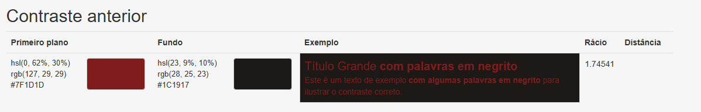
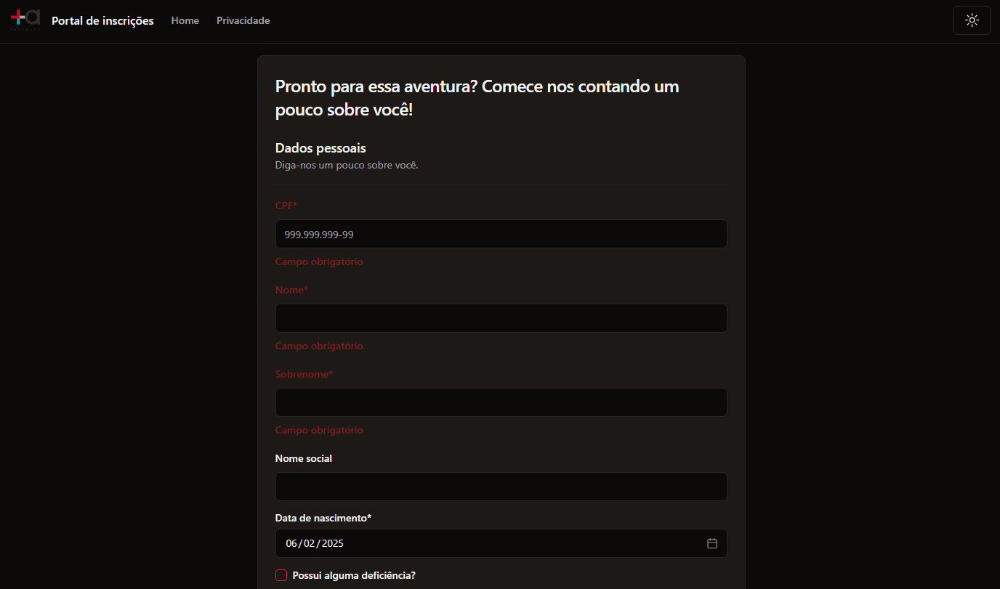

## É possível selecionar "Selecione uma opção..." na listagem de níveis de ensino
## Combobox de nível de ensino traz o último item clicado sempre pre selecionado
## Pós-graduações estão sendo listadas junto com os cursos de graduações
## Usuário é alertado mas não é impedido de inserir mais caracteres que o permitido
## Data de nascimento aceita data futura e inválida (texto)
## Cor de alerta não tem bom contraste com o fundo no modo escuro
 
 
## Campos de nome e telefone aceitam caracteres além dos numéricos
## Campo "CEP" permite caracteres além dos numéricos
## Alerta de usuário inválido na tela de login só aparece após inserir algum caracter no campo senha
-> Se não preencher nenhum dos dados e clicar em Login aparece o alerta somente na senha
P.S.: A senha está sendo validada no front e a validação da senha ocorre em tempo real em relação a digitação
Além disso, a senha está sendo validada isoladamente, sem a necessidade do usuário
Por ser uma aplicação que não realiza requisições pro backend para realizar a autenticacao e deve apenas simular uma autenticação, não separei o item em um bug só.
## Campo qual deficiencia não é obrigatório
-> Ao marcar a flag "Possui alguma deficiência?" o preenchimento do campo "Qual deficiência?" deveria ser obrigatorio
-> Além disso, o campo poderia ser alterado de texto para opções pré definidas, facilitando a recuperação desse dado para questoes estratéticas no futuro

## Minhas inscrições e Financeiro não implementados
Validado o acesso às páginas, mas as mesmas ainda não foram implementadas